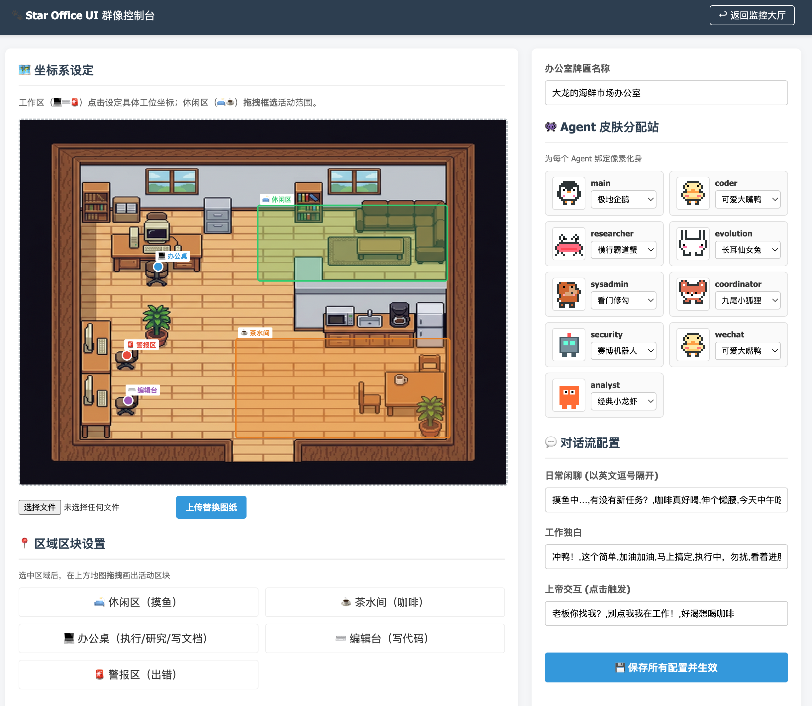

# 🐾 Star Office UI

[中文版](#chinese) | [English Version](#english)

<a name="chinese"></a>
## 中文说明

一个为 OpenClaw 开发的**像素风云端办公室**，可以根据各 Agent 的实时工作状态，让对应的像素小人同步执行"写代码"、"查资料"或"摸鱼"等动作，并支持高度自定义的管理后台。

### 📸 效果预览

**监控大厅（前台）**


**管理后台**


### ✨ 特性
- **多 Agent 精准追踪**：独立追踪每个 Agent 的活跃状态。哪个 Agent 在工作，哪个 Agent 的小人就走去工位，其他人继续摸鱼。
- **活跃度防噪**：只监控 `agent/embedded` 子系统的真实推理日志，过滤掉 cron、diagnostic 等后台噪音。
- **等比例响应式**：支持多种屏幕分辨率与手机访问，Phaser Scale Manager 自动等比缩放。
- **15 种像素皮肤**：龙虾、机器人、猫咪、史莱姆、幽灵、小兔、青蛙、狐狸、熊、鸭、企鹅、熊猫、狗、螃蟹、小猫共 15 种可爱动态皮肤。
- **可视化后台**：在线上传背景图、分配皮肤、在地图上**拖拽**框选活动区域（工作区点击即设定）、配置随机话术。
- **Agent 状态看板**：画面右上角玻璃卡片实时显示所有 Agent 工作/待命状态，带绿色脉冲光效。
- **趣味互动**：点击画布任意位置，随机 Agent 会走过来并触发吐槽；说到"咖啡"会自动导航去茶水间。

### ⚙️ 安装与配置
1. **项目部署**: 将本项目文件夹整体放入您的 OpenClaw `workspace` 目录下。
2. **Sidecar 运行**: 建议将 `start.sh` 配置为 OpenClaw 的 sidecar 进程，或在后台独立运行：
   ```bash
   # 后台启动
   nohup ./start.sh > office.log 2>&1 &
   ```

### 🚀 快速启动
1. **安装依赖**: `pip install -r requirements.txt`
2. **生成精灵图集**: `python3 generate_sprites.py` 与 `python3 generate_avatars.py`
3. **启动**: 执行 `./start.sh`。访问 `http://localhost:18888`。
```bash
# 1. 安装依赖
pip install -r requirements.txt

# 2. 生成精灵图集
python3 generate_sprites.py
python3 generate_avatars.py

# 3. 启动
./start.sh
```

### 🌐 访问地址
| 页面 | URL |
|------|-----|
| 监控大厅（前台）| `http://服务器IP:18888/` |
| 管理后台 | `http://服务器IP:18888/admin` |

### ⚙️ 管理后台使用
1. 上传自定义办公室背景图（建议尺寸 **1200×900 PNG**，俯视像素风）。
2. 为每个 Agent 分配专属皮肤。
3. 在左侧地图上设定区域：**工作区点击即设点**，**休闲区拖拽框选范围**，Agent 会均匀分布在框选的矩形内。
4. 配置各状态下的随机对话台词。
5. 点击"保存配置并生效"，前台即时更新。

### 📂 文件结构
```
star-office-ui/
├── backend/app.py          # Flask 后端
├── frontend/
│   ├── index.html          # 监控大厅（Phaser 前台）
│   └── admin.html          # 管理后台
├── office_sync.py          # OpenClaw 日志监听同步器
├── set_state.py            # 状态写入工具
├── start.sh                # 一键启动脚本
└── static/                 # 精灵图集存放位置
```

---

<a name="english"></a>
## English Version

A **Pixel-Art Cloud Office** built for OpenClaw. It precisely tracks each Agent's real-time activity and animates the corresponding pixel character — working Agent walks to a desk, idle ones slack off or grab coffee.

### 📸 Preview

**Monitoring Hall (Frontend)**


**Admin Dashboard**


### ✨ Features
- **Per-Agent Precise Tracking**: Each Agent is tracked independently. Only the active Agent walks to a workstation; others stay idle.
- **Noise Filtering**: Only `agent/embedded` real inference logs are monitored, filtering out `cron`, `diagnostic`, and other background scheduler noise.
- **Responsive Scaling**: Supports multiple screen resolutions including mobile. Phaser Scale Manager handles proportional fit-scaling automatically.
- **15 Pixel Skins**: Lobster, Robot, Cat, Slime, Ghost, Kitty, Bunny, Frog, Fox, Bear, Duck, Penguin, Panda, Dog, Crab — 15 adorable animated skins.
- **Visual Admin Dashboard**: Upload backgrounds, assign skins, **drag** to define idle zones on the map (work spots are single-click), configure dialogue lines.
- **Agent Status Panel**: Glass-morphism card at top-right shows live working/idle status with pulsing green light effects.
- **Interactive**: Click anywhere to summon a random Agent. Mentioning "coffee" triggers a navigation to the break room.

### ⚙️ Installation & Config
1. **Deployment**: Place the project folder into your OpenClaw `workspace` directory.
2. **Sidecar / Background Run**: It's recommended to configure `start.sh` as an OpenClaw sidecar, or run it manually in the background:
   ```bash
   # Background start
   nohup ./start.sh > office.log 2>&1 &
   ```

### 🚀 Quick Start
1. **Dependencies**: `pip install -r requirements.txt`
2. **Assets**: Run `python3 generate_sprites.py` and `python3 generate_avatars.py`
3. **Run**: Execute `./start.sh`. Visit `http://localhost:18888`.
```bash
pip install -r requirements.txt
python3 generate_sprites.py && python3 generate_avatars.py
./start.sh
```

### 🌐 Access URLs
| Page | URL |
|------|-----|
| Monitoring Hall | `http://<your-server-ip>:18888/` |
| Admin Dashboard | `http://<your-server-ip>:18888/admin` |

### ⚙️ Admin Panel Usage
1. Upload a custom office background (recommended: **1200×900 PNG**, pixel art top-down view).
2. Assign a skin to each Agent.
3. Set area zones on the map: **click to place** work area points; **drag to draw** idle zone rectangles.
4. Configure random dialogue lines for each state.
5. Click "Save and Apply" — the frontend updates instantly.

---

## 📄 License & Copyright

Copyright (c) 2026 **Jason**. All rights reserved.

This project is created by **Jason**. Unauthorized copying of the files, via any medium, is strictly prohibited.

本项目版权归 **Jason** 所有。未经许可，禁止通过任何媒介进行非法复制或分发。

---
感谢使用 Star Office UI! 😆
